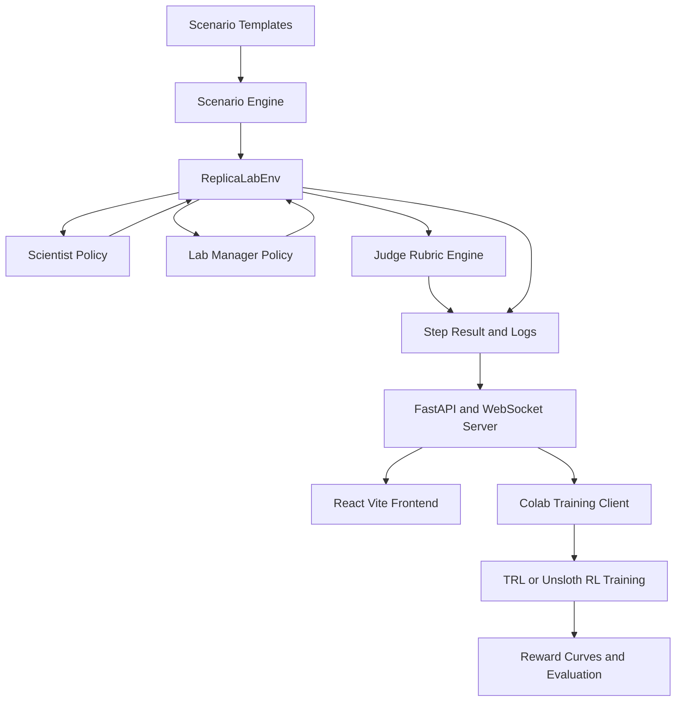

# ReplicaLab Master Blueprint

## 1. Executive summary

**ReplicaLab** is an OpenEnv based scientific replication environment.

In each episode, the system creates:

1. An original experiment or paper summary
2. A lab with real constraints such as budget, equipment, reagent stock, staffing, and time
3. A negotiation task where a **Scientist agent** and a **Lab Manager agent** must agree on a valid replication plan

The core idea is simple:

**One agent knows what the science needs. One agent knows what the lab can actually do. They must negotiate a replication plan that is scientifically valid and realistically feasible.**

This becomes a true environment because it has state, actions, observations, transitions, rewards, and episode termination. It is not just a chatbot prompt. It is a structured, trainable world.

---

## 2. The real world problem we are targeting

ReplicaLab targets the gap between **ideal scientific protocols** and **real lab constraints**.

In the real world, many experiments are hard to replicate because:

1. Papers describe ideal methods
2. Labs lack the full equipment or materials
3. Budgets and schedules are limited
4. Some substitutions are acceptable, but some break the science
5. Teams must decide what is essential and what can change

So the real question ReplicaLab asks is:

**How do we adapt an experiment without breaking the science?**

This is the practical version of the replication crisis problem.

---

## 3. One line pitch

**ReplicaLab is an OpenEnv environment where a Scientist agent and a Lab Manager agent negotiate how to replicate scientific experiments under realistic lab constraints, and RL trains the Scientist to make better replication decisions over time.**

---

## 4. Which hackathon tracks we are following

ReplicaLab touches **4 out of the 5** hackathon problem statements.

### 4.1 Primary tracks

#### A. Multi Agent Interactions

This is the strongest fit.

Why:

1. The Scientist and Lab Manager hold different private information
2. Neither can solve the task alone
3. They must negotiate, exchange information, and converge

#### B. World Modeling, Professional Tasks

This is the second strongest fit.

Why:

1. The environment simulates a real scientific workflow
2. The agent must reason inside a partially observable professional world
3. It must infer what the lab can and cannot do before making a good plan

### 4.2 Supporting tracks

#### C. Long Horizon Planning and Instruction Following

Why:

1. The task takes several rounds
2. The agent must ask, revise, recover from mistakes, and plan ahead
3. Reward is delayed until a protocol is good enough

#### D. Self Improvement

Why:

1. The same environment is used for RL training
2. The Scientist improves across repeated episodes
3. The environment supports curriculum and replay later on

### 4.3 Track summary

**Tracks touched technically:** 4

**Tracks we should lead with in the pitch:** 2

1. Multi Agent Interactions
2. World Modeling

**Tracks we should mention as supporting evidence:**

1. Long Horizon Planning
2. Self Improvement

---

## 5. Sponsor and partner alignment

### 5.1 Best sponsor fits

#### Halluminate

Best fit because ReplicaLab is a true **multi actor environment**.

1. The Scientist is one actor
2. The Lab Manager is another actor
3. The Judge can later act as a third oversight actor

#### Snorkel AI

Best fit because ReplicaLab behaves like **simulated experts in the loop**.

1. The Scientist acts like a domain expert
2. The Lab Manager acts like an operations expert
3. The learning model improves through repeated expert style interactions

### 5.2 Good optional fit

#### Fleet AI

This becomes stronger if the Judge is framed as an **oversight agent** that monitors, explains, and audits the decisions of the Scientist and Lab Manager.

### 5.3 Resource fit

1. **Hugging Face** for Spaces deployment and credits
2. **Unsloth** for RL notebooks and simpler training setup
3. **Northflank** for H100 access if faster training is needed
4. **Cursor** for coding speed only

---

## 6. Why this is truly an environment

ReplicaLab is an environment because it contains the full RL loop.

### 6.1 State

The state contains:

1. The paper or experiment description
2. The hidden minimum viable replication spec
3. The lab constraints
4. The round number
5. The negotiation history
6. The current proposed protocol
7. The current score state
8. Whether the episode is done

### 6.2 Actions

The Scientist can:

1. Propose a protocol
2. Revise a protocol
3. Request information
4. Accept

The Lab Manager can:

1. Report feasibility
2. Suggest alternatives
3. Reject
4. Accept

### 6.3 Observations

Each role sees a different view of the world.

The Scientist sees scientific requirements and negotiation state.

The Lab Manager sees operational constraints and negotiation state.

### 6.4 Transitions

Each step updates:

1. The conversation history
2. The current protocol
3. The round counter
4. Budget usage if needed
5. The done status if agreement happens or time runs out

### 6.5 Reward

The environment returns a score based on:

1. Scientific rigor
2. Feasibility
3. Fidelity to the original experiment

That is what makes it a trainable environment instead of a static task.

---

## 7. The core environment loop

### 7.1 One episode

1. `reset(seed=42)` creates a paper, a lab context, and a hidden evaluation rubric
2. The Scientist receives its observation
3. The Lab Manager receives its observation
4. The Scientist acts first
5. The Lab Manager responds
6. This repeats for up to a fixed number of rounds
7. If both accept, the episode ends successfully
8. If time runs out, the episode ends with a penalty
9. The Judge computes the final reward

### 7.2 Environment methods

The environment should implement:

1. `reset()`
2. `step()`
3. `state()`
4. `close()`

These are the core methods that make the system compatible with OpenEnv serving and RL rollouts.

---

## 8. Scenario environments inside ReplicaLab

For the MVP, we should use **3 scenario families**.

### 8.1 MVP scenario families

#### A. Cell Biology

Example:
Drug effect on cell proliferation using MTT or WST1 style assay

Why it is good:

1. Easy to explain
2. Has obvious lab constraints
3. Good match between rigor and feasibility tradeoffs

#### B. Machine Learning Benchmark Replication

Example:
Reproducing a benchmark result with limited GPU budget and compute time

Why it is good:

1. Easier to simulate
2. Good for judges who understand ML
3. Strong world modeling story around compute, time, and reproducibility

#### C. Behavioral Psychology Survey Study

Example:
Replicating a survey study with participant limits, time limits, and platform constraints

Why it is good:

1. Gives variety beyond wet lab work
2. Shows broader scientific replication use case
3. Easy to explain ethical and logistical constraints later on

### 8.2 Stretch scenario families

1. Biochemistry
2. Materials Science
3. Chemistry

---

## 9. How each model interacts with the others

### 9.1 Scientist agent

Role:
Protect scientific validity

Knows:

1. The paper goal
2. Important methodological elements
3. Hidden scientific priorities through the environment design
4. The negotiation history

Does not directly know:

1. Full budget
2. Full inventory
3. Full equipment schedule
4. Full staffing details

Main job:
Design a protocol that still counts as a meaningful replication.

### 9.2 Lab Manager agent

Role:
Protect operational feasibility

Knows:

1. Budget
2. Equipment availability
3. Booking conflicts
4. Reagent stock
5. Personnel constraints
6. Safety restrictions
7. The negotiation history

Does not directly know:

1. Which scientific elements are absolutely critical
2. Which substitutions are scientifically acceptable unless told

Main job:
Tell the Scientist what is actually possible and suggest realistic alternatives.

### 9.3 Judge agent

Role:
Audit the final plan and score it

Knows:

1. Original paper summary
2. Minimum viable replication rubric
3. Final protocol
4. Actual constraints
5. Full conversation history

Main job:
Compute the final reward and optionally explain it in plain English.

---

## 10. How the agents should be implemented

### 10.1 MVP implementation choice

For the hackathon MVP:

1. **Scientist** should be the only trained LLM policy
2. **Lab Manager** should be rule based and deterministic
3. **Judge** should be a deterministic rubric engine with optional LLM explanation

This is the safest and most realistic build path.

### 10.2 Why only one agent should be trained first

1. It reduces instability
2. It makes reward improvement easier to show
3. It makes the environment more deterministic and judge friendly
4. It gives a clean before versus after story

### 10.3 Scientist creation

The Scientist can be built from a small instruct model with structured JSON output.

The prompt should instruct it to:

1. Protect scientific validity
2. Ask for missing information before committing
3. Output only valid schema fields
4. Avoid invalid or impossible protocols

### 10.4 Lab Manager creation

The Lab Manager should be implemented as a deterministic policy layer that:

1. Checks budget
2. Checks equipment availability
3. Checks stock and restock timing
4. Checks staff limits
5. Returns templated natural language plus structured feasibility data

### 10.5 Judge creation

The Judge should be implemented as:

1. A rubric based scoring engine
2. An audit note generator
3. Optionally, an explanation layer that converts scores into readable comments for the frontend

---

## 11. How the judge agent is integrated

The Judge is integrated **inside the environment**.

It is called:

1. At the end of the episode for final reward computation
2. Optionally after each round for intermediate score previews

### 11.1 What the Judge evaluates

1. Whether critical controls were preserved
2. Whether sample size is sufficient
3. Whether substitutions are scientifically acceptable
4. Whether the plan fits budget and inventory
5. Whether the plan is faithful enough to the original design

### 11.2 What the Judge returns

1. `rigor_score`
2. `feasibility_score`
3. `fidelity_score`
4. `total_reward`
5. `judge_notes`

### 11.3 Important design rule

The Judge should not be the entire reward source through free form opinions.

The Judge should primarily be a **deterministic rubric engine**.

That makes training, replay, and scoring much more stable.

---

## 12. Reward structure

The reward should be easy to explain and hard to game.

### 12.1 Core reward dimensions

#### A. Rigor

Questions:

1. Did the final plan preserve critical scientific elements?
2. Are the controls present?
3. Is sample size good enough?
4. Is the technique valid?
5. Is the study duration acceptable?

#### B. Feasibility

Questions:

1. Is the plan within budget?
2. Is the equipment actually available?
3. Are the reagents in stock or restockable in time?
4. Is the timeline realistic?
5. Is staffing sufficient?

#### C. Fidelity

Questions:

1. How close is the proposed protocol to the original experiment?
2. Did the core method stay intact?
3. Did the control logic stay intact?
4. Is the sample size close enough?

### 12.2 Composite reward

Use a multiplicative core so the agent cannot cheat.

```text
base_reward = rigor * feasibility * fidelity * 10
bonus = efficiency_bonus + communication_bonus
penalty = timeout_penalty + invalid_action_penalty + over_budget_penalty
final_reward = base_reward + bonus - penalty
```

### 12.3 Why this is good

1. High rigor but impossible protocol still scores poorly
2. Cheap but scientifically broken protocol still scores poorly
3. Fast, thoughtful negotiation gets rewarded
4. The score is intuitive for judges

---

## 13. How RL works in ReplicaLab

### 13.1 Simple explanation

RL works like this:

1. The Scientist tries an action in the environment
2. The environment responds through the Lab Manager and Judge logic
3. The Scientist gets a reward at the end
4. Training pushes the Scientist toward behaviors that earn higher rewards

### 13.2 What behavior should improve

Over time, the Scientist should learn to:

1. Ask better questions before proposing
2. Avoid impossible protocols
3. Preserve critical scientific details
4. Choose better substitutions
5. Reach agreement faster
6. Reduce invalid actions

### 13.3 What model should be trained

For the MVP, train only the Scientist.

That gives the clearest reward curve and the cleanest training narrative.

---

## 14. How self improvement works

### 14.1 MVP self improvement

Self improvement in the MVP simply means:

**The Scientist gets better after repeated episodes.**

That is enough to satisfy the track.

### 14.2 Stretch self improvement ideas

1. Curriculum learning from easy to medium to hard scenarios
2. Post episode self critique before retry
3. Later training of both Scientist and Lab Manager
4. Automatic scenario difficulty scaling

---

## 15. How world modeling is being done

World modeling means the agent must reason about a hidden world and update its internal understanding over time.

In ReplicaLab, that world includes:

1. What equipment exists
2. What equipment is missing
3. Which items are booked
4. What is in stock
5. What can be substituted
6. What is scientifically critical
7. What tradeoffs hurt future feasibility

The Scientist does not see all of this at once.

So it must build a mental model of the lab through dialogue, feedback, and revision.

That is why ReplicaLab fits the world modeling track strongly.

---

## 16. How long horizon planning is being done

Long horizon planning appears because the task is multi step.

A good Scientist should:

1. Understand the experimental goal
2. Ask for missing constraints
3. Propose an initial protocol
4. Revise after operational feedback
5. Trade off rigor against feasibility
6. Converge before timeout

This is not one shot generation. It is multi round planning with delayed reward.

---

## 17. How constraints work

Constraints come from a seeded scenario generator.

### 17.1 Constraint categories

1. Budget
2. Time limit
3. Equipment availability
4. Equipment booking calendar
5. Reagent stock
6. Reagent restock timelines
7. Personnel count
8. Safety restrictions

### 17.2 Difficulty levels

#### Easy

The lab has most of what is needed.

#### Medium

The lab is missing some important pieces and requires thoughtful substitutions.

#### Hard

The lab is missing major pieces and forces serious protocol redesign.

### 17.3 How constraints should change

For the MVP, keep each episode deterministic once the seed is fixed.

That means:

1. `reset(seed=42)` always produces the same paper and constraint world
2. The world only changes because of the agents’ actions
3. No random hidden shocks should happen inside an episode yet

This makes testing and replay much stronger.

---

## 18. What the end result should be

The end result is **not** a full system that proves whether a paper is true or false.

The end result should be:

1. A working OpenEnv environment
2. A trained Scientist agent
3. A stable Lab Manager policy
4. A Judge rubric engine
5. A public Hugging Face Space
6. A training notebook that shows reward improvement
7. A visual demo that clearly shows untrained versus trained behavior

The final result we are trying to fit is:

**a trainable benchmark and demo for scientific replication planning under constraints**

---

## 19. What the interface should look like

### 19.1 Frontend choice

**React + Vite** is the right choice.

It is faster and cleaner than trying to build a full Cursor style IDE interface.

### 19.2 UI layout

#### Left panel

1. Original paper summary
2. Key scientific requirements
3. Seed
4. Scenario type
5. Round counter

#### Middle panel

1. Negotiation log
2. Scientist messages in blue
3. Lab Manager messages in green
4. Judge summary at the end

#### Right panel

1. Current proposed protocol
2. Budget bar
3. Inventory summary
4. Score bars for rigor, feasibility, and fidelity
5. Final composite score

#### Bottom controls

1. New episode
2. Seed selector
3. Scenario selector
4. Replay slider
5. Before versus after training toggle

### 19.3 Fallback option

If the custom UI slips, use the OpenEnv web interface as a fallback and polish only the essential display panels.

---

## 20. Architecture overview



---

## 21. How exactly we are using the hackathon tools

### 21.1 OpenEnv 0.2.1

Used for:

1. Defining the environment interface
2. Creating the stateful RL world
3. Serving the environment over FastAPI and WebSocket
4. Enabling clients to connect locally or remotely

### 21.2 Hugging Face Spaces

Used for:

1. Public deployment
2. Judge accessible demo hosting
3. Satisfying the official submission requirement

### 21.3 Docker

Used for:

1. Packaging the backend and optional frontend
2. Ensuring the app runs on port 7860 in HF Spaces

### 21.4 Colab

Used for:

1. The required minimal training script
2. Running rollouts against the environment
3. Plotting reward improvement

### 21.5 TRL or Unsloth

Used for:

1. Training the Scientist policy
2. Applying RL against the environment reward
3. Producing visible reward curves and before versus after behavior

### 21.6 Matplotlib

Used for:

1. Reward curve visualization
2. Component score plots
3. Training summary charts

### 21.7 GitHub

Used for:

1. Public source code
2. README
3. Notebook storage
4. Architecture documentation

### 21.8 YouTube

Used for:

1. The one minute demo video required by the hackathon

---

## 22. Scope of work

### 22.1 In scope for the hackathon MVP

1. OpenEnv environment implementation
2. 3 scenario families
3. Scientist as the trainable policy
4. Rule based Lab Manager
5. Deterministic Judge rubric engine
6. FastAPI and WebSocket server
7. Docker deployment
8. Hugging Face Space
9. Colab training notebook
10. Reward curve
11. React Vite frontend or clean fallback UI
12. Public GitHub repo
13. Demo video
14. README

### 22.2 Stretch scope if ahead of schedule

1. LLM based Lab Manager
2. Judge explanation LLM
3. Live replay mode
4. Before versus after split screen
5. More scientific domains
6. Difficulty curriculum

### 22.3 Out of scope

1. Proving a real paper is factually true or false
2. Full autonomous laboratory automation
3. Real wet lab execution
4. Arbitrary paper ingestion from the internet
5. Full self play between multiple LLM agents
6. Complex enterprise integrations unrelated to the core demo

---

## 23. Folder structure

```text
replicalab/
├── README.md
├── pyproject.toml
├── openenv.yaml
├── .dockerignore
├── replicalab/
│   ├── __init__.py
│   ├── models.py
│   ├── client.py
│   ├── prompts/
│   │   ├── scientist.txt
│   │   ├── lab_manager.txt
│   │   └── judge.txt
│   ├── scenarios/
│   │   ├── templates.py
│   │   ├── cell_biology.py
│   │   ├── ml_benchmark.py
│   │   └── behavioral_psych.py
│   ├── scoring/
│   │   ├── rubric.py
│   │   ├── rigor.py
│   │   ├── feasibility.py
│   │   └── fidelity.py
│   ├── agents/
│   │   ├── scientist_policy.py
│   │   ├── lab_manager_policy.py
│   │   └── judge_policy.py
│   ├── env/
│   │   └── replicalab_env.py
│   ├── utils/
│   │   ├── seed.py
│   │   ├── validation.py
│   │   └── logging.py
│   └── outputs/
│       ├── logs/
│       ├── replays/
│       └── plots/
├── server/
│   ├── app.py
│   ├── requirements.txt
│   └── Dockerfile
├── frontend/
│   ├── package.json
│   ├── vite.config.ts
│   └── src/
│       ├── App.tsx
│       ├── components/
│       └── pages/
├── notebooks/
│   └── train_colab.ipynb
└── tests/
    ├── test_env.py
    ├── test_reward.py
    ├── test_scenarios.py
    └── test_server.py
```

---

## 24. How the judges are likely to judge the project

The hackathon judging criteria emphasize:

1. Environment innovation
2. Storytelling
3. Training improvement
4. Reward and pipeline coherence

### 24.1 Why ReplicaLab scores well

#### Environment Innovation

Strong because this is a partially observable scientific negotiation world, not a toy single prompt task.

#### Storytelling

Strong because the Scientist versus Lab Manager framing is intuitive and memorable.

#### Training Improvement

Strong because the Scientist can visibly improve through RL and reward curves.

#### Reward and Pipeline Coherence

Strong because the scoring dimensions are simple and explainable.

### 24.2 Ideal judge demo flow

1. Show the problem in one sentence
2. Start a seeded episode
3. Show the paper and lab constraints
4. Show the back and forth negotiation
5. Show the score breakdown
6. Replay the same seed with the trained Scientist
7. Show higher reward and better decision quality

---

## 25. Completion rate expectations

### 25.1 Project completion reality

With a focused 4 person team, we should aim to complete:

**90 percent of the judge critical MVP**

Even if that is only around **60 percent of the full dream vision**, that is completely fine.

### 25.2 Environment success metrics

Track these metrics:

1. Average reward
2. Agreement rate
3. Average rounds to agreement
4. Invalid action rate
5. Reward by scenario difficulty

A strong demo should show:

1. Higher reward after training
2. Higher agreement rate after training
3. Fewer invalid proposals after training
4. Faster convergence after training

---

## 26. Team split for 4 people

### Person 1: Environment and scoring owner

Owns:

1. Scenario generation
2. Environment state and transitions
3. Constraint system
4. Reward logic
5. Tests

### Person 2: RL and model owner

Owns:

1. Scientist prompts and action schema
2. Training notebook
3. TRL or Unsloth integration
4. Reward curves
5. Before versus after evaluation

### Person 3: Backend and deployment owner

Owns:

1. FastAPI server
2. WebSocket protocol
3. Docker image
4. HF Spaces deployment
5. Logs and replay endpoints

### Person 4: Frontend and story owner

Owns:

1. React Vite UI
2. Visual score panels
3. Demo polish
4. README
5. One minute YouTube demo

---

## 27. Workflow for the team

### 27.1 Build order

1. Freeze environment schema and reward structure
2. Build one scenario end to end
3. Add deterministic Lab Manager
4. Add Judge rubric engine
5. Connect FastAPI and WebSocket serving
6. Add basic frontend
7. Add Colab training notebook
8. Deploy to HF Space
9. Add remaining scenarios
10. Record demo and finish README

### 27.2 Runtime workflow

1. User starts a new episode
2. The environment generates a seeded paper and lab
3. The Scientist receives its observation
4. The Lab Manager receives its observation
5. The Scientist proposes or asks a question
6. The Lab Manager replies with feasibility data
7. The environment updates state
8. The Judge computes intermediate or final scores
9. The episode ends on agreement or timeout
10. The replay is stored for demo and evaluation

---

## 28. Revenue model

This is not needed for judging, but it is useful for investor or product framing.

### 28.1 Possible revenue paths

#### A. Enterprise experiment planning assistant

Sell a planning and auditing tool to biotech and research organizations.

#### B. Scientific AI benchmark licensing

Offer ReplicaLab as a benchmark for labs or AI teams evaluating scientific agents.

#### C. Simulation API

Charge for API access to scenarios, scoring, and replay infrastructure.

#### D. Workflow software expansion

Expand later into experiment design, lab operations support, and protocol adaptation copilots.

---

## 29. Five year old explanation

Imagine two kids want to bake a cake.

1. One kid knows the recipe
2. One kid knows what is inside the kitchen

The recipe kid says, “We need chocolate.”

The kitchen kid says, “We do not have chocolate, but we have cocoa.”

Then they talk until they find the best cake they can make.

If the cake still tastes good, uses what the kitchen has, and finishes on time, they get a star.

ReplicaLab is that, but for science experiments.

---

## 30. Final recommended positioning

### 30.1 Best main pitch

**ReplicaLab is an OpenEnv scientific negotiation environment where a Scientist agent and a Lab Manager agent collaborate to design valid experiment replications under real world lab constraints. We train the Scientist with RL so it learns to ask better questions, make better tradeoffs, and reach better replication plans over time.**

### 30.2 Best track framing

**Primary:** Multi Agent Interactions and World Modeling

**Supporting:** Long Horizon Planning and Self Improvement

### 30.3 Best sponsor framing

**Primary sponsor fit:** Halluminate and Snorkel AI

**Optional supporting narrative:** Fleet AI through the Judge as an oversight layer

### 30.4 Best MVP framing

1. Train only the Scientist
2. Keep the Lab Manager rule based
3. Keep the Judge rubric based
4. Ship 3 scenario families
5. Show one strong before versus after training demo

---

## 31. Final “done” definition

ReplicaLab is done for the hackathon when we have:

1. A working OpenEnv environment
2. A deployed HF Space on port 7860
3. A public GitHub repo
4. A Colab notebook with visible reward improvement
5. A one minute YouTube demo
6. A clear README
7. A clean story that judges understand in under one minute

That is the real finish line.
